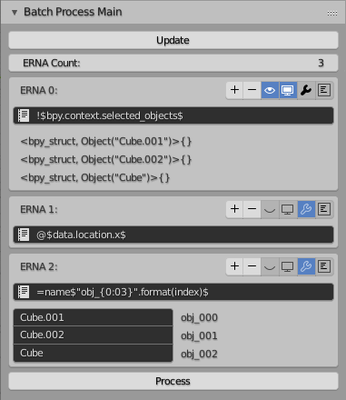

# Batch Process - Batch Process Multiple Properties With ERNA Syntax

## What is Batch Process add-on
Sometimes we want to set properties or do some jobs with simple rules.
These rules include

- Rename selected objects into "obj_000", "obj_001", ... sorted by their x position.
- Rename bones from "leg left thigh" to "leg___thigh.L" and "leg right thigh" to "leg___thigh.R"..
- Import "*.obj" files in folder "obj" (reletive to current blend file).
- Reload all images used by selected objects' materials

Batch Process add-on helps you get these jobs done with one special syntaxed string.

## Advantages 
- Less Code 

  One string instead of a 10 ~ 20 line python script with multiple for loops.

- Interactive UI

  + Preview of each intermediate steps instead of hand writing `print` functions.
  + Inplace error message and syntax error indicator.
  + Check every changing values before doing the actual process.

- Reuseability

  Use preset files to save and load your rules.

## Disadvantages
- For blender 2.8 only.
- To use this add-on effectively requires basic python programming skill.
- You should be comfortable with python documentation and blender python api documentation.
- Beta Version

## Installation
1. Download the Batch Process add-on source code somewhere.
2. Copy folder `batch_process` into *`<your blender path>/2.80/scripts/addons_contrib/`*.
3. Open blender click *Edit->Preferences->Add-ons* and enable *Testing* support level.
4. Search *Batch Process* and enable it.

## How it works

### Concepts
The one string you input is called a ERNA(Extended RNA Data Path).
Just like RNA in blender is used to get one property of one object.
ERNA is used to get multiple properties of multiple objects.
We call these bunch of objects a *collection*. 
Each one of these objects itself is called *data* of *collection*.
ERNA is the rule of Transforming from one *collection* into another *collection*.

### A Simple Example
```
## Rename selected objects into "obj_000", "obj_001", ... sorted by their x position.
!$bpy.context.selected_objects$@$data.location.x$=name$"obj_{0:03}".format(index)$
```

This long ERNA can be seperated by parts and each part is indicating a *collection* Transform.
Each ERNA Part is just a shorter ERNA.
The following steps show each part and how Batch Process add-on interpret them.

1. `!$bpy.context.selected_objects$` -> `[<obj_c>, <obj_b>, <obj_a>]`

    `!$<expr>$` is the syntax of *Initial Operation*.
    It simply ignore the input *collection* and use the value of `<expr>` as output Collection.
    `<expr>` is any python expresion that return an iterable object.

2. `@$data.location.x$` -> `[<obj_a>, <obj_b>, <obj_c>]`

    `@$<expr>$` is the syntax of *Sort Operation*.
    Sort all *data* in *collection* by using `<expr>` to calculate the sort key.

3. `=name$"obj_{0:03}".format(index)$` -> `[<obj_a>, <obj_b>, <obj_c>]`

    `=<name>$<expr>$` is the syntax of *Assign Operation*.
    Assign "name" property of each *data* with value of `<expr>`.
    Assign Operation will not change *collection* but store the assign information.
    The actual assignment is done later when user click the process button.

### Another Example With Binding Variables
```
## Rename bones from "leg left thigh" to "leg___thigh.L" and "leg right thigh" to "leg___thigh.R".
!$bpy.context.selected_objects$data.bones*
%${"left" : " left ", "right" : " right ", "holder" : "___"}$
%${"is_left" : left in data.name, "is_right" : right in data.name}$
|$is_left or is_right$
=name$prop.replace(left if is_left else right, holder) + (".L" if is_left else ".R")$
```
You may bind new variables into namespaces with ERNA.
There are two namespaces when interpreting a ERNA. 

| space           | description                                                                                         |
|-----------------|-----------------------------------------------------------------------------------------------------|
| *builtin space* | accessable everywhere, you can't change this space during processing, mainly contain python modules |
| *data space*    | one for each *data*, change by *Variable Operation*                                                 |

Interpret Steps
1. `!$bpy.context.selected_objects$` -> `[<Armature>]`

    Use *Initial Operation* to get the selected armature object.

2. `data.bones` -> `[[<leg left thigh>, <leg right thigh>, <pelvis>]]`

    `name.name.name.name` is the syntax of *Property Operation*.
    Access each *data*'s `name.name.name.name` property as result *collection*.
    Here we access `data.bones` of `Armature` so we got bones.
    Now our *collection* have one *data* and the *data* contains all bones of selected armature.

3. `*` -> `[<leg left thigh>, <leg right thigh>, <pelvis>]`

    `*` is the syntax of *Flatten Operation*.
    *Flatten Operation* assumes each *data* contains multiple *item*s.
    It append all *item*s togather as the result *collection*.
    Now our *collection* have three *data*s which are bones of selected armature.

4. `%${"left" : " left ", "right" : " right ", "holder" : "___"}$` 

    `%$<expr>$` is the syntax of *Variable Operation*
    *Variable Operation* do not change *data* but bind new variables to *data*.
    For the following ERNA with python expression. 
    You may use variable `left` to get a str value `" left "`.
    These variables here are served as setting of this ERNA.
    Change these values will change the behavior of this ERNA.

5. `%${"is_left" : left in data.name, "is_right" : right in data.name}$` 

    *Variable Operation* Again
    For *data* `<leg left thigh>` bind variables {"is_left":True, "is_right":False}.
    For *data* `<leg right thigh>` bind variables {"is_left":False, "is_right":True}.

4. `|$is_left or is_right$` *Filter Operation* `[<leg left thigh>, <leg right thigh>]`

    Filter *collection* with variables we just bind.
    Here both <leg left thigh> and <leg right thigh> pass the filter.

5. `=name$prop.replace(left if is_left else right, holder) + (".L" if is_left else ".R")$` *Assign Operation*

    Use variables we just bind to replace string and deside ".L" or ".R" to append

## User Interface
After Batch Process add-on enabled, three panels will appear at "Misc" panel of the sidebar (press "N" to show the sidebar).


### Batch Process Main Panel



- Update Button : Reinterpret all ERNA, update UI bellow.
- ERNA Count : Count of ERNA Parts, Change this will append or trim with empty ERNA.
- ERNA 0 1 2 3 ... : Block for ERNA Part

  

  + Insert new ERNA before current ERNA.
  + Delete current ERNA.
  + Toggle data preview.
  + Toggle variable preview.
  + Toggle assign preview.
  + Toggle accessable property.


### Batch Process Preset Panel

### Batch Process Settings Panel

## ERNA Syntax Reference

### Property Operation
```
<name>
<name>.<name>.<name> ...
```
For each *data* access property `<name>.<name>.<name>` then put into result *collection*.
`<name>` is a valid python identifier.

| *collection*               | ERNA    | *collection* Transformed                     |
|----------------------------|---------|----------------------------------------------|
| `[data_0, data_1, data_2]` | `name`  | `[data_0.name, data_1.name, data_2.name]`    |
| `[data_0, data_1, data_2]` | `a.b.c` | `[data_0.a.b.c, data_1.a.b.c, data_2.a.b.c]` |

### Map Operation
```
-$<expr>$
```
For each *data* put the value of `<expr>` into result *collection*.
`<expr>` is a python expression with following local variables.

| Variable    | Value                        |
|-------------|------------------------------|
| length      | length of *collection*       |
| index       | index of *data* start from 0 |
| data        | value of *data*              |


| *collection*               | ERNA           | *collection* Transformed                  |
|----------------------------|----------------|-------------------------------------------|
| `[data_0, data_1, data_2]` | `-$data.name$` | `[data_0.name, data_1.name, data_2.name]` |

### Flatten Operation
```
*
*$<expr>$
```
Access each *Item* inside *data* as result *collection*, *data* must have `__iter__` method.

| *collection*                                   | ERNA | *collection* Transformed                   |
|------------------------------------------------|------|--------------------------------------------|
| `[[item_0_0, item_0_1], [item_1_0, item_1_1]]` | `*`  | `[item_0_0, item_0_1, item_1_0, item_1_1]` |

If `<expr>` is not provided, no new local variables introduced.
If `<expr>` is provided, it is a python expression with following local variables.

| Variable    | Value                        |
|-------------|------------------------------|
| length      | length of *collection*       |
| index       | index of *data* start from 0 |
| data        | value of *data*              |
| length_data | length of *data*             |
| index_item  | index of *Item* start from 0 |
| item        | value of *Item*              |

With these variables you have `collection[index][index_item] == item`
The value of `<expr>` is a dict which is used to introduce new local variables to item.

| *collection*               | ERNA                             | *collection* Transformed                   |
|----------------------------|----------------------------------|--------------------------------------------|
| `[[item_0_0], [item_1_0]]` | `*${"i":index, "j":index_item}$` | `[item_0_0{i:0, j:0}, item_1_0{i:1, j:0}]` |

### Sort Operation
```
@
@$<expr>$
```
Stable sort *collection* 

if `<expr>` is not provided, sort by *data* as key.

if `<expr>` is provided,  it is a python expression with following local variables

| Variable | Value                  |
|----------|------------------------|
| length   | length of *collection* |
| data     | value of *data*        |

The value of `expr` is used as the sort key.

Suppose we have `data_0.name == "c" and data_1.name == "b" and data_2.name == "a"`

| *collection*               | ERNA           | *collection* Transformed   |
|----------------------------|----------------|----------------------------|
| `[data_0, data_1, data_2]` | `@$data.name$` | `[data_2, data_1, data_0]` |

### Filter Operation
```
|$<expr>$
```
Filter *collection* with the value of `<expr>`.

`<expr>` is any valid python expression with following local variables

| Variable | Value                        |
|----------|------------------------------|
| length   | length of *collection*       |
| index    | index of *data* start from 0 |
| data     | value of *data*              |

The value of `<expr>` is a bool which test whether the *data* exist in result *collection*.

Suppose we have `data_0.name == "a" and data_1.name == "b" and data_2.name == "c"`

| *collection*               | ERNA                  | *collection* Transformed |
|----------------------------|-----------------------|--------------------------|
| `[data_0, data_1, data_2]` | `|$data.name == "b"$` | `[data_1]`               |
| `[data_0, data_1, data_2]` | `|$index % 2 == 0$`   | `[data_0, data_2]`       |

### Take Operation
```
[<start>:<stop>:<step>]
```

Take *data* in *collection* with python slice similar syntax.
`<start>`, `<stop>` and `<step>` are int numbers.

| *collection*                               | ERNA    | *collection* Transformed   |
|--------------------------------------------|---------|----------------------------|
| `[data_0, data_1, data_2, data_3, data_4]` | `[2]`   | `[data_2]`                 |
| `[data_0, data_1, data_2, data_3, data_4]` | `[2:4]` | `[data_2, data_3]`         |
| `[data_0, data_1, data_2, data_3, data_4]` | `[::2]` | `[data_0, data_2, data_4]` |

### Variable Operation
```
%$<expr>$
```
`%$<expr>$` Introduce new variables to *data space*.

`<expr>` is a python expression with following local variables

| Variable | Value                        |
|----------|------------------------------|
| length   | length of *collection*       |
| index    | index of *data* start from 0 |
| data     | value of *data*              |

The return value of `<expr>` is a dict which is used to introduce new variables.
This operation will not change *collection*.

| *collection*       | ERNA                         | *collection* Transformed               |
|--------------------|------------------------------|----------------------------------------|
| `[data_0, data_1]` | `%${"i":index, "l":length}$` | `[data_0{i:0, l:2}, data_1{i:1, l:2}]` |

### Assign Operation
```
=<name>$<expr>$
```

Store an assignment which assign value of `<expr>` to *data*.`<name>` property.
Will do the actual assignment after user click the process button.

| Variable | Value                        |
|----------|------------------------------|
| length   | length of *collection*       |
| index    | index of *data* start from 0 |
| data     | value of *data*              |
| prop     | value of *data*`.<name>`     |

### Delay Operation
```
\$<expr>$
```

Delay the evaluation of `<expr>` until process button is clicked.

### Global Space
All python expression `<expr>` may access global variables in following table.

| Variables      |    |           |
|----------------|----|-----------|
| `__builtins__` | re | mathutils |

If you want to access python modules that are not listed here, 
you have to manually change `Expression_Globals` in source code file `globals_model.py`

### ERNA Grammar Specification
```
erna -> op* t_stop
op -> one of op_???
op_prop -> ["."] (t_name | t_expr) ("." (t_name | t_expr))*
op_map -> "-" t_expr
op_init -> "!" (t_expr | t_number)
op_flatten -> "*" [ t_expr ]
op_sort -> "@" [ t_expr ]
op_filter -> "|" t_expr
op_take -> "[" t_number [ ":" t_number [ ":" t_number ]] "]"
op_var -> "%" t_expr
op_assign -> "=" t_name t_expr
op_delay -> "\" t_expr
```

## Preset File Syntax
A preset file is just a plain text file which save multiple ERNA with keys.
It is saved as text data so you may edit it with blender text editor or append it across blender files.
The Batch Process Preset Panel is used to load preset file and set ERNA to Batch Process Main Panel.
A preset file has a simple line based syntax showing bellow.

```
# Any characters after "#" of a line are comments
<zero or more empty lines>
<key_0> # The key must be unique for each preset file
<erna_0>
<erna_1>
<one or more empty lines>
<key_1>
<erna_0>
<erna_1>
<erna_2>
<one or more empty lines>
<key_2>
<erna_0>
```

## Examples
File `EXAMPLES.txt` in source code show some examples in preset file syntax.
